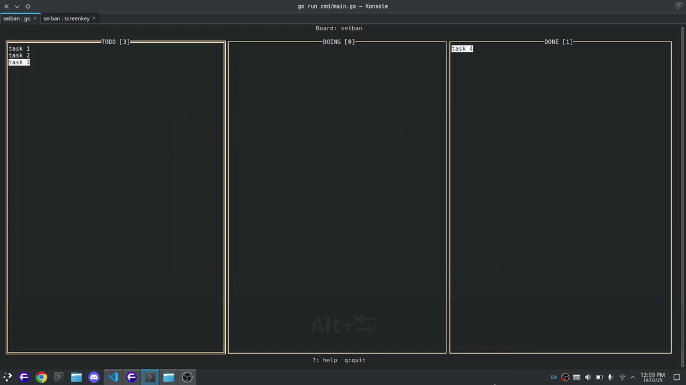

# Seiban
Seiban—derived from the Japanese words "Seiri" (整理) meaning "organization" and "Kanban" (看板) meaning "signboard" — is a fast and simple terminal-based Kanban board manager. It enables users to efficiently manage tasks directly from the command line, streamlining workflow and enhancing productivity.

## Demo


## Features
- `Vim-Style Keybindings`: Navigate and manage tasks using familiar Vim commands for a seamless experience.
- `Markdown Data Storage`: Tasks are stored in a Markdown file, ensuring simplicity and compatibility.
- `Undo/Redo Operations`: Easily revert or reapply changes to maintain flexibility in task management.

## Installation
To run the application, you must have [Go](https://go.dev/dl/) installed in your system.
1. Clone the repository
```bash
git clone github.com/ppriyankuu/seiban
```

2. Run the application
```bash
go run cmd/main.go
```

## Keybinds
You can press `?` in the application itself to see the keybinds. But for reference they are here as well -

| Key          | Description                     |
| ------------ | --------------------------------|
| j            | Move down                       |
| k            | Move up                         |
| l / h        | Move left / right               |
| J / K        | Move task down / up the list    |
| L / H        | Move task left / right the lists|
| a            | add task under the cursor       |
| A            | add task at the end of list     |
| D            | Delete a task                   |
| d            | Mark a task as done             |
| e            | Edit a task                     |
| Enter        | View task information           |
| g            | focus first item of list        |
| G            | focus last item of list         |
| u            | undo                            |
| Ctrl+R       | redo                            |
| ?            | To view all these keybinds      |
| q            | Quit application                |